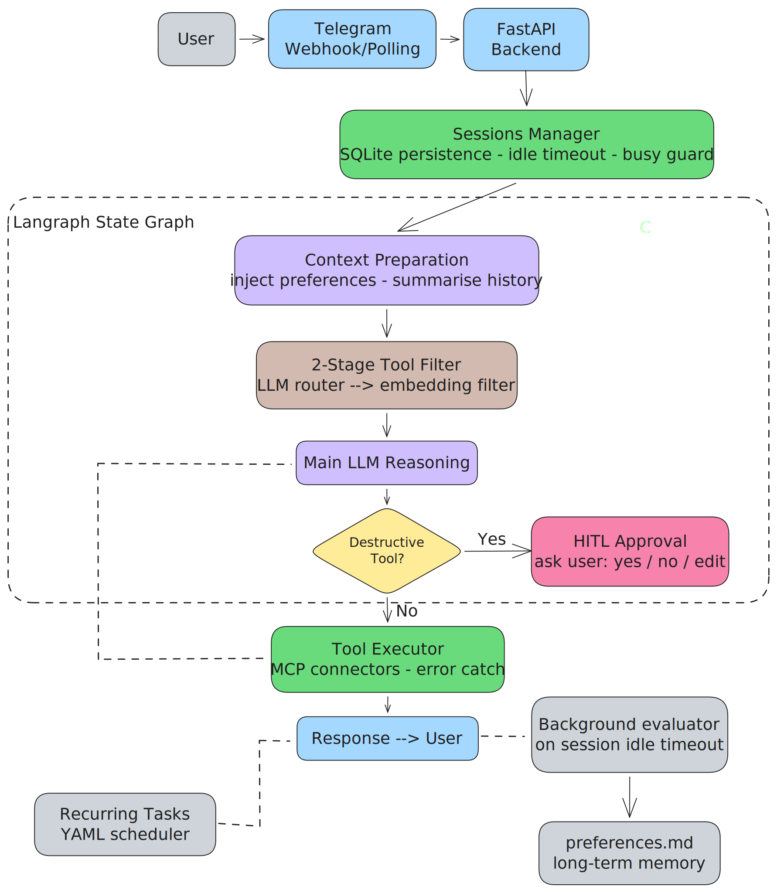
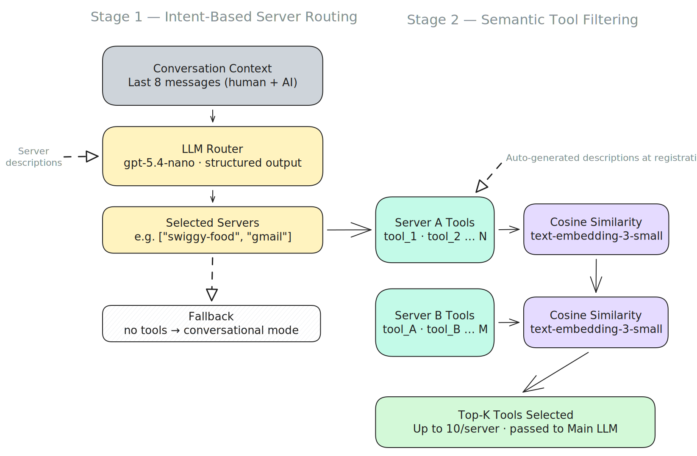
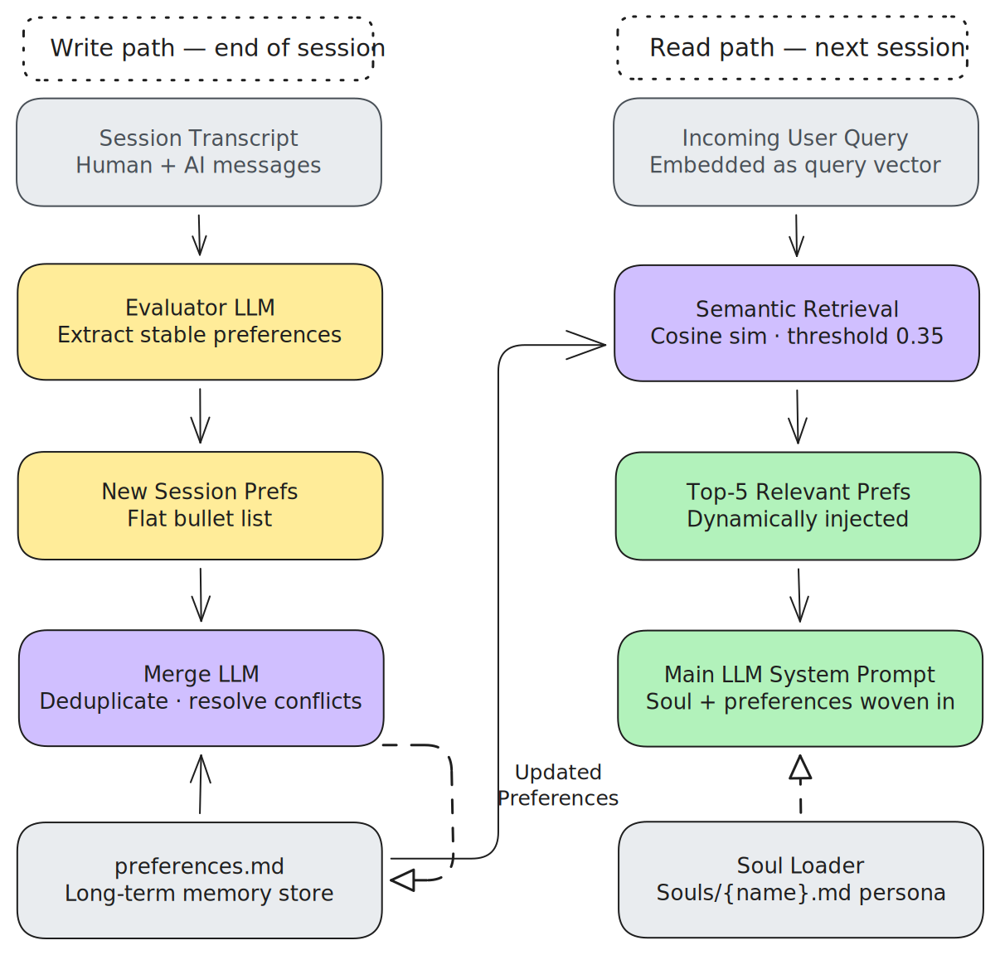
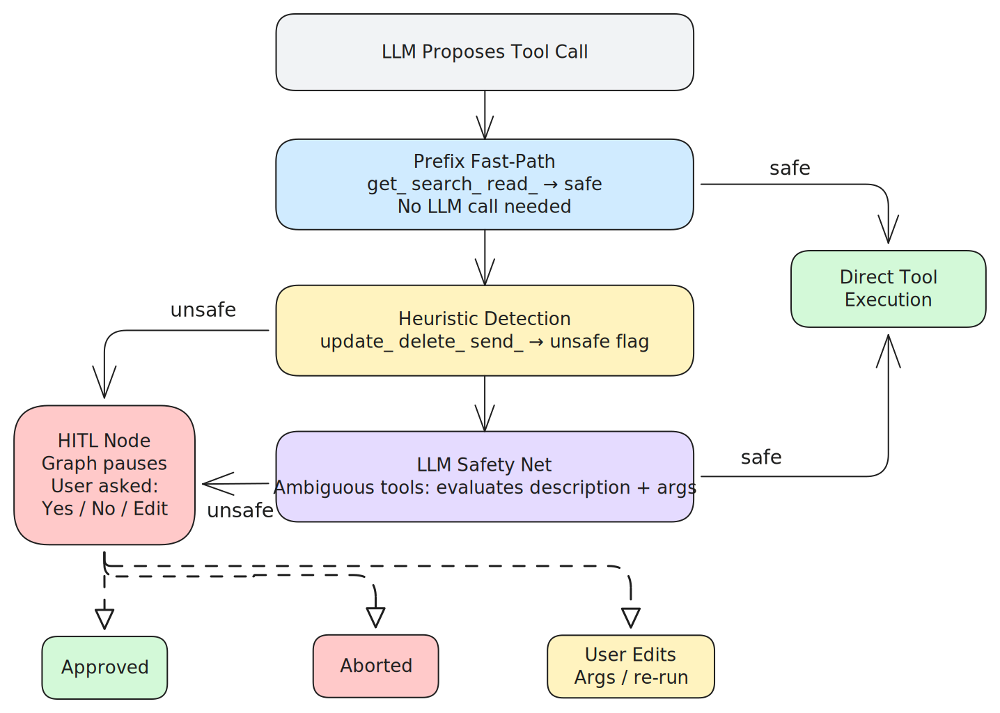
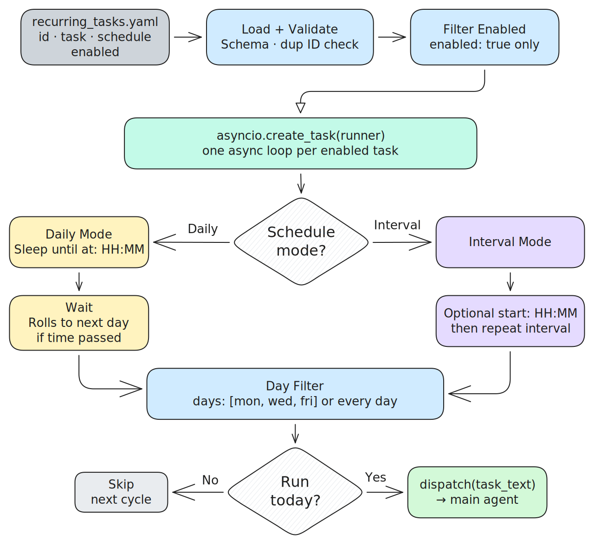
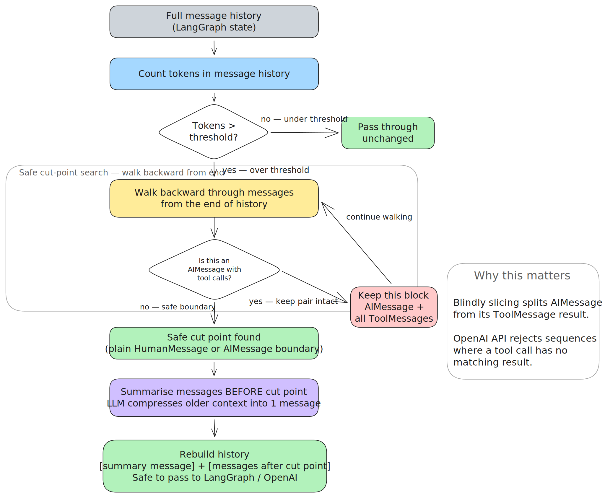

# S10M0213 — Personal AI Agent

A production-grade personal AI agent that lives in your Telegram. It handles real-world tasks through MCP-connected services, remembers your preferences across sessions, runs scheduled tasks around the clock, and always asks before doing anything destructive — all within a single, cost-efficient architecture.

---

## What It Does

You talk to it through Telegram like any other chat. Behind the scenes, it connects to services like Swiggy, Gmail, and Telegram itself, executes tasks on your behalf, and gets smarter about your habits over time. It's always on, it remembers you, and it won't do anything irreversible without asking first.

---

## Architecture Overview



A message arrives via Telegram, passes through the FastAPI backend and session manager, then enters the LangGraph state graph. Inside the graph, the system prepares context (injecting relevant user preferences), fetches only the tools needed for this specific request, reasons with the main LLM, optionally pauses for human approval on destructive actions, executes tools, and sends back a response.

---

## Core Capabilities

### Handles Unlimited Tools Without Losing Focus

Most agents fall apart as you add more tools — the context window fills up, costs spike, and the model starts hallucinating wrong tool calls. This system solves that with a **two-stage retrieval pipeline** that filters tools *before* they ever reach the main LLM.



**Stage 1 — Intent routing:** A cheap nano model reads the last 8 messages and decides which *services* are relevant right now (e.g. only Swiggy, not Gmail). Everything else is ignored entirely.

**Stage 2 — Semantic filtering:** Within each selected service, tool descriptions are compared to the query using cosine similarity. Only the top 10 most relevant tools per service are passed forward.

The result: the main LLM always sees a short, focused list of tools regardless of how many are registered. You can add 500 more tools tomorrow and the model won't know or care about the ones that aren't relevant.

---

### Remembers You — And Gets Better Over Time

The agent builds a personal profile of you automatically. Every session, after you've been idle for 5 minutes, an evaluator LLM analyses the conversation and extracts stable behavioural patterns — things like ordering preferences, communication style, time habits, or how you like information presented.



These are stored as a clean flat list in `preferences.md`. When preferences contradict each other (you said you prefer concise responses last month but now you clearly want detail), the merge step resolves the conflict and keeps only the newer version.

On every new session, only the preferences *relevant to your current request* are retrieved via semantic search and woven into the system prompt. You're not stuffing the context with everything — just what matters right now.

The agent's core personality and tone live separately in `Souls/{name}.md`, which can be swapped out entirely without touching any application logic.

---

### Never Does Anything Destructive Without Asking

Every tool call goes through a three-gate safety pipeline before execution.



**Gate 1 — Prefix fast-path:** Tools starting with `get_`, `search_`, `read_` are immediately marked safe. No LLM call needed.

**Gate 2 — Heuristic detection:** Tools starting with `update_`, `delete_`, `send_` are flagged as unsafe automatically.

**Gate 3 — LLM safety net:** Anything ambiguous gets evaluated by a dedicated safety LLM that reads the tool description and the arguments being passed.

If a tool is flagged unsafe, the LangGraph graph *pauses* and asks you: approve, abort, or edit the arguments. Nothing happens until you decide. If a tool hallucinated by the model doesn't exist, the executor catches it cleanly and returns a `ToolMessage` saying "Tool not found" — no graph crashes, no cascading errors.

---

### Always On — Scheduled Tasks Run 24/7

The agent doesn't just respond to messages. It proactively executes tasks on a schedule, dispatching them into the main agent the same way a user message would be handled.



Tasks are defined in plain YAML — no code changes needed to add, modify, or disable them:

```yaml
- id: morning_news
  enabled: true
  task: "Summarize the top AI news headlines"
  schedule:
    mode: daily
    at: "08:00"
    days: [mon, tue, wed, thu, fri]

- id: email_check
  enabled: true
  task: "Check unread emails and flag anything urgent"
  schedule:
    mode: interval
    every: 30m
    days: [mon, tue, wed]
```

Each enabled task gets its own independent async loop. Schedules support daily execution at a specific time, fixed intervals (minutes or hours), and optional weekday filters.

---

### Sessions Survive Server Downtime

Sessions are persisted to SQLite and survive crashes, restarts, and planned downtime. On every boot, the system scans all stored sessions and reconciles them: sessions that expired while the server was down are cleaned up, and valid sessions have their idle timers reconstructed from where they left off.

The LangGraph checkpoint store lives in the same database, so the full conversation context is restored exactly where it was — no lost history, no cold-start on reconnect.

On unexpected shutdown, a 10-second graceful drain gives in-flight tasks time to settle their database commits before the process is force-killed.

---

### Keeps Context Sharp as Conversations Grow Long

Long conversations accumulate fast, especially with tool calls. Once the message history exceeds 15,000 tokens, the context trimmer kicks in.



It walks backward through the message history to find a safe cut point — specifically, it never splits an `AIMessage` (tool call) from its corresponding `ToolMessage` (result), because the OpenAI API rejects sequences where a tool call has no matching result. Everything before the cut is compressed into a single summary message. The active portion of the conversation stays intact.
